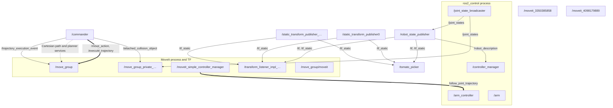

# Agrobot workspace

ROS 2 Jazzy workspace: 20 packages under `Agrobot/src/`, built with `colcon`. Sibling `EPOS2ROSBridge/` and `ros2_canopen/` folders are excluded.

## Packages

A **package** contains code, executables, configuration, and launch files. A **node** is a named ROS participant running that code. One package can supply several node executables; one process can contain several nodes. Nodes can use C++ (`rclcpp`) or Python (`rclpy`) and communicate through the same ROS interfaces.

Paths below are under `Agrobot/src/`.

| Package | Role |
| --- | --- |
| [robot_description](Agrobot/src/robot_description/) | Robot geometry, joints, and meshes. |
| [moveit_config](Agrobot/src/moveit_config/) | MoveIt planning configuration. |
| [robot_bringup](Agrobot/src/robot_bringup/) | Robot startup launch files. |
| [robot_interfaces](Agrobot/src/robot_interfaces/) | Robot messages, services, and actions. |
| [robot_commander](Agrobot/src/robot_commander/) | Motion commands through MoveIt. |
| [epos2_bridge](Agrobot/src/epos2_bridge/) | EPOS2 motor control bridges. |
| [epos2_bridge_interfaces](Agrobot/src/epos2_bridge_interfaces/) | EPOS2 motion services. |

Bundled packages under `Agrobot/src/ros2_canopen/` provide motor-drive communication over CAN:

| Package | Role |
| --- | --- |
| [canopen](Agrobot/src/ros2_canopen/canopen/) | Package collection and documentation. |
| [canopen_core](Agrobot/src/ros2_canopen/canopen_core/) | Device containers and driver lifecycle. |
| [canopen_interfaces](Agrobot/src/ros2_canopen/canopen_interfaces/) | CANopen messages and services. |
| [lely_core_libraries](Agrobot/src/ros2_canopen/lely_core_libraries/) | Underlying Lely CANopen libraries. |
| [canopen_base_driver](Agrobot/src/ros2_canopen/canopen_base_driver/) | Shared driver functionality. |
| [canopen_master_driver](Agrobot/src/ros2_canopen/canopen_master_driver/) | CANopen master. |
| [canopen_proxy_driver](Agrobot/src/ros2_canopen/canopen_proxy_driver/) | Device access through ROS. |
| [canopen_402_driver](Agrobot/src/ros2_canopen/canopen_402_driver/) | CiA402 motor-drive control. |
| [canopen_ros2_control](Agrobot/src/ros2_canopen/canopen_ros2_control/) | ros2_control hardware interfaces. |
| [canopen_ros2_controllers](Agrobot/src/ros2_canopen/canopen_ros2_controllers/) | ros2_control controllers. |
| [canopen_fake_slaves](Agrobot/src/ros2_canopen/canopen_fake_slaves/) | Mock CANopen devices. |
| [canopen_tests](Agrobot/src/ros2_canopen/canopen_tests/) | Integration tests and examples. |
| [canopen_utils](Agrobot/src/ros2_canopen/canopen_utils/) | Test utilities. |

## Build

Requires ROS 2 Jazzy, colcon, and package dependencies. From the repository root:

```bash
cd Agrobot
source /opt/ros/jazzy/setup.bash
set -o pipefail
build_run="../build_logs/$(date +%Y%m%d-%H%M%S)"
mkdir -p "$build_run"
colcon --log-base "$build_run/colcon" build --parallel-workers 4 \
  --event-handlers console_direct+ 2>&1 | tee "$build_run/terminal.log"
```

Builds reuse `Agrobot/build/` and `Agrobot/install/`. Each run saves a master `terminal.log` and separate package logs under `colcon/`.

All 20 packages compiled on 2026-09-23. No fixes were applied; warnings were limited to:

| Package | Warning / log |
| --- | --- |
| canopen_interfaces | Generated timestamp 0.026 s ahead; clock skew. [Log](build_logs/compile-ybgPHn/colcon/build_2026-09-23_15-20-58/canopen_interfaces/stderr.log) |
| lely_core_libraries | Deprecated `setup.py install`, obsolete `AC_PROG_CC_STDC`, `AC_CHECK_HEADERS` literals, libtool relinking. [Log](build_logs/compile-ybgPHn/colcon/build_2026-09-23_15-20-58/lely_core_libraries/stderr.log) |
| canopen_ros2_control | `memcpy` reads 2 bytes from a 1-byte region, `canopen_system.hpp:264`. [Log](build_logs/compile-ybgPHn/colcon/build_2026-09-23_15-20-58/canopen_ros2_control/stderr.log) |
| canopen_ros2_controllers | Deprecated `tl_expected`/`get_value()`; ignored `set_value()` results. [Log](build_logs/compile-ybgPHn/colcon/build_2026-09-23_15-20-58/canopen_ros2_controllers/stderr.log) |
| canopen_fake_slaves | Possibly dangling reference, `basic_slave.hpp:123`. [Log](build_logs/compile-ybgPHn/colcon/build_2026-09-23_15-20-58/canopen_fake_slaves/stderr.log) |

## Launches

### ROS terms

| Term | Meaning |
| --- | --- |
| Topic | Typed messages sent from publishers to subscribers. |
| Service | One request from a client and one response from a server. |
| Action | A goal, progress feedback, and a final result; supports cancellation requests. |
| Launch file | Starts processes and supplies configuration. Executables determine node names unless launch overrides them. |

Topics, services, and actions connect nodes; they are not additional nodes.

### Terminal environment

```bash
source /opt/ros/jazzy/setup.bash
source /tmp/agrobot-next-build-ybgPHn/install/setup.bash
export ROS_DOMAIN_ID=193 ROS_AUTOMATIC_DISCOVERY_RANGE=LOCALHOST
```

This loads the isolated install used on 2026-09-23 and restricts discovery to this host in domain 193. A default build uses `Agrobot/install/setup.bash`.

### Robot, MoveIt, and RViz

```bash
ros2 launch moveit_config demo.launch.py
```

[demo.launch.py](Agrobot/src/moveit_config/launch/demo.launch.py) calls MoveIt's `generate_demo_launch()`. The [configuration](Agrobot/src/moveit_config/config/ros2_controllers.yaml) uses mock hardware (`mock_components/GenericSystem`); this launch does not start EPOS2 or drive real motors.

| Node / component | Package / executable or plugin | Role |
| --- | --- | --- |
| /static_transform_publisher0 | tf2_ros / static_transform_publisher | Fixed `world → world_frame` transform. |
| /robot_state_publisher | robot_state_publisher / robot_state_publisher | URDF and link transforms from joint states. |
| /move_group | moveit_ros_move_group / move_group | Planning, scene monitoring, and trajectory execution. |
| /rviz | rviz2 / rviz2 | Robot display and MoveIt panel; enabled by default. |
| /controller_manager | controller_manager / ros2_control_node | Mock hardware and controllers at 100 Hz. |
| /arm_controller | joint_trajectory_controller / JointTrajectoryController | Trajectories for `joint0`–`joint6`. |
| /joint_state_broadcaster | joint_state_broadcaster / JointStateBroadcaster | Joint feedback. |

Two temporary `controller_manager/spawner` processes activate the arm controller and broadcaster, then exit. Controllers run inside the controller-manager process. The gripper controller is configured but not spawned; the optional database defaults off.

The sibling EPOS2ROSBridge demo uses robot name `my_robot` and virtual transform `world → base_link`; this document otherwise describes Agrobot.

### Commander and tomato picker

```bash
ros2 launch robot_commander commander.launch.py
```

[commander.launch.py](Agrobot/src/robot_commander/launch/commander.launch.py) starts three processes and does not include the demo launch:

| Node | Package / executable | Role |
| --- | --- | --- |
| /commander | robot_commander / commander | MoveIt command subscriptions and pick-sequence action server. |
| /tomato_picker | robot_commander / tomato_picker.py | Filters detections and publishes target poses. |
| /static_transform_publisher_<generated suffix> | tf2_ros / static_transform_publisher | Placeholder camera transform. |

Commander receives `moveit_config.to_dict()`; the picker has no explicit launch parameters. The camera transform is `linear_rail_link → camera_color_optical_frame`, translation `(0, 0.2, 0)` m and roll/pitch/yaw `(-1.5708, 0, 0)` rad, pending calibration.

## Commander code

Source: [commander.cpp](Agrobot/src/robot_commander/src/commander.cpp).

### Objects and startup

```cpp
rclcpp::init(argc, argv);
auto node = std::make_shared<rclcpp::Node>("commander");
auto commander = std::make_shared<Commander>(node);
rclcpp::spin(node);
rclcpp::shutdown();
return 0;
```

1. Initialize ROS using the command-line arguments.
2. Create the ROS node named `commander`.
3. Construct the `Commander` object, registering its interfaces.
4. `spin(node)` blocks while processing callbacks until shutdown.
5. Shut down the ROS context and return exit status 0.

`node` holds a **shared pointer**, not the node object itself. The constructor copies it into `Commander::node_`: two pointers share ownership of the same object. The object is destroyed when its last owning shared pointer releases it. `Commander::node_` means the `node_` member of class `Commander`; the underscore is a naming convention. `/commander` is a ROS name, not a memory address.

`Commander` contains application logic and holds pointers to the ROS node (`node_`) and MoveIt interface (`arm_`). The node does not store the Commander object. Here, `rclcpp::spin()` accepts a shared pointer to a node or its base interface; an executor's `spin()` takes no argument after nodes are added.

### MoveIt interface

```cpp
arm_ = std::make_shared<MoveGroupInterface>(node_, "arm");
arm_->setMaxVelocityScalingFactor(1.0);
arm_->setMaxAccelerationScalingFactor(1.0);
arm_->setEndEffectorLink("link6");
```

`MoveGroupInterface` is a C++ class; `arm_` points to an instance that uses `node_` to request planning and execution from the separate `/move_group` node.

The launch builder loads the URDF and SRDF from `moveit_config` into parameters, including `robot_description_semantic`. [robot.srdf](Agrobot/src/moveit_config/config/robot.srdf) defines:

```xml
<group name="arm">
    <chain base_link="linear_rail_link" tip_link="link6"/>
</group>
```

The interface selects this group by name. Scaling factors of `1.0` permit 100% of configured velocity and acceleration limits; `0.5` would permit 50%. They are limits, not commanded speeds. `link6` selects the frame placed at pose targets; it does not operate the gripper. These settings configure the interface, leave the SRDF unchanged, and do not initiate motion.

### Command subscriptions

All names below are under `/agrobot/`; message definitions are in [robot_interfaces/msg](Agrobot/src/robot_interfaces/msg/).

| Topic / type | Fields | Callback and target |
| --- | --- | --- |
| pose_cmd / PoseCommand | `string pose_name` | `poseCmdCallback`: saved joint configuration. |
| joint_cmd / JointCommand | `float64 j0`–`j6` | `jointCmdCallback`: seven absolute joint positions. `j0` is metres; `j1`–`j6` are radians. |
| position_cmd / PositionCommand | `float64 x, y, z, roll, pitch, yaw`; `bool cartesian_path` | `positionCmdCallback`: link6 position (metres) and orientation (radians). |
| proceed / std_msgs/msg/Bool | `bool data` | `proceedCallback`: true sets the proceed flag; false is ignored. The sequence never calls `waitForProceed()`. |

Each subscription stores its shared pointer to remain alive. For example:

```cpp
pose_cmd_sub_ = node_->create_subscription<PoseCommand>(
    "/agrobot/pose_cmd", 10,
    std::bind(&Commander::poseCmdCallback, this, _1));
```

`PoseCommand` is the message type; `10` is history depth. `std::bind` connects the method to this Commander object (`this`); `_1` receives the incoming message. `spin()` later invokes the callback.

**Named command (`pose_cmd`).** The callback receives `PoseCommand::SharedPtr msg`, copies `msg->pose_name`, and accepts exactly `crouch`, `attention`, `vertical`, or `bin`. Names are case-sensitive; other values are silently ignored.

`goToPoseTarget(name)` sets the start to the current state, calls `setNamedTarget(name)`, then `planAndExecute(arm_)`. The SRDF supplies joint values, not a stored trajectory. For example, `crouch` selects `[0, 0, -0.25, 1.4, 1.55, 0.25, 0]` for joint0–joint6. A new SRDF name also needs adding to the callback's allowed names.

**Joint command (`joint_cmd`).** The callback builds `{j0, j1, …, j6}`, then sets the current start state and calls `setJointValueTarget(joints)`. Values follow the planning group's variable order; no joint names accompany the vector. All seven targets are supplied together, with no “leave unchanged” field.

**Position command (`position_cmd`).** The helper converts roll/pitch/yaw to a normalized quaternion and constructs a pose in `world_frame`. With `cartesian_path=false`, `setPoseTarget()` and `planAndExecute()` request a route to the pose; a straight end-effector path is not required. With `true`, `computeCartesianPath()` uses one waypoint and a 0.01 m sampling step, executing only if completion fraction equals 1. This branch passes a bare pose, dropping the header, so it uses the interface's pose reference frame rather than explicitly selecting `world_frame`.

**Planning result.** `planAndExecute()` calls `plan()`, executes on planning success, or logs `Planning failed`. It does not check the execution result or return completion to the topic publisher. Incomplete Cartesian paths are not executed and produce no explicit log here. These messages specify no speed or duration and do not command the gripper.

### Publisher search

No publishers for these three command topics were found in the workspace or extracted source under Windows `OneDrive/Documents/nucbox_archive`. This is a source-search finding, not a live publisher check.

The archive's `agrobot_ws/src/robot_commander/src/commander.cpp` uses `/agrobot/named_pose_cmd` instead of `/agrobot/pose_cmd`. Its `agrobot_ui/dashboard.js` Home, Pick, and Reset buttons only display placeholder alerts.

## Detection and picking

Source: [tomato_picker.py](Agrobot/src/robot_commander/src/tomato_picker.py). Topic names below are under `/agrobot/`.

| Topic / type | Direction | Contents |
| --- | --- | --- |
| tomato_spatial / std_msgs/msg/String | External detector → picker | JSON array: `tomato_id`, `confidence`, camera-frame `centroid`, and `sphere.radius`. Filtered, transformed, and sorted by base-frame Y. |
| safe_to_pick / std_msgs/msg/Bool | External publisher → picker | False discards detection batches; defaults true. Does not cancel active Commander actions. |
| pick_targets / geometry_msgs/msg/PoseArray | Picker → no subscriber in these launches | Three poses per tomato: approach, grasp, retract, in `linear_rail_link`. No bin pose. |

Commander serves [PickSequence](Agrobot/src/robot_interfaces/action/PickSequence.action) at `/agrobot/pick_sequence`:

| Part | Contents |
| --- | --- |
| Goal | `targets` PoseArray; three poses per tomato, interpreted in `linear_rail_link`. Commander adds named target `bin` after each triplet. |
| Feedback | `tomato_index` (1-based), `total_tomatoes`, `step` (approaching/grasping/retracting/binning), `awaiting_confirm` (currently false). |
| Result | `success` and `message`; sequence completion or cancellation. Motion failures are not propagated by `planAndExecute()`. |
| Cancellation | Checked between steps. |

The picker publishes a topic, not an action goal. Commander does not subscribe to `pick_targets`; the recorded graph had one publisher and zero subscribers. Neither launch starts the detector, safety publisher, command-topic publishers, or pick-sequence client.

## ROS communication

### Main channels

| Channel | Connection / payload |
| --- | --- |
| /robot_description | State publisher → controller manager/model consumers: URDF XML. |
| /robot_description_semantic | MoveIt → model consumers: SRDF XML. |
| /joint_states, /dynamic_joint_states | Broadcaster → state consumers: joint positions and other available state interfaces. |
| /tf, /tf_static | Robot and static publishers → TF listeners: moving/fixed transforms. |
| /monitored_planning_scene, /display_planned_path | MoveIt → RViz: scene and planned trajectories. |
| /planning_scene, /planning_scene_world, /collision_object, /attached_collision_object | Scene publishers → MoveIt: world, robot, and object updates. |
| /arm_controller/joint_trajectory | Optional external publisher → controller: direct timed joint targets. |
| /arm_controller/controller_state | Controller → monitors: desired/actual state and tracking error. |
| /move_action (action) | Commander/RViz → MoveIt: target constraints and planning options; returns feedback, trajectory, and error code. |
| /execute_trajectory (action) | Commander/RViz → MoveIt: trajectory; returns execution feedback and result. |
| /arm_controller/follow_joint_trajectory (action) | MoveIt → controller: timed targets/tolerances; returns tracking feedback and result. |
| /compute_cartesian_path (service) | Commander → MoveIt: start state/waypoints; returns trajectory, fraction, and error code. |

MoveIt also exposes planning (`/plan_kinematic_path`, `/plan_sequence_path`, `/sequence_move_group`), scene (`/get_planning_scene`, `/apply_planning_scene`), kinematics (`/compute_ik`, `/compute_fk`, `/check_state_validity`), and planner-setting interfaces (`/query_planner_interface`, `/get_planner_params`, `/set_planner_params`).

Spawners use controller-manager load/configure/switch services; `list_controllers` reports state. Commander adds no application service server; its MoveIt interface creates Cartesian/planner clients. Shared ROS support includes `/rosout`, `/parameter_events`, per-node parameter services, and diagnostic/lifecycle channels.

### Recorded runtime graph — 2026-09-23

This is the earlier inspection, not a fresh runtime check. Sixteen launch-created nodes remained active; RViz and its helpers had exited, as had the temporary spawners. The ROS CLI daemon is excluded. Solid arrows are topics, thick arrows actions, and dashed arrows services; responses/feedback return to clients. Endpoints do not prove commands were sent.



Commander’s execution-event and attached-object publishers are interface endpoints unused by its current callbacks. Nodes without arrows expose support endpoints; intra-process calls/shared state are omitted. External command/detection clients were absent, and `pick_targets` had no subscriber.

| Shortened label | Observed full name |
| --- | --- |
| /move_group_private_… | /move_group_private_95487689054560 |
| /transform_listener_impl_… | /transform_listener_impl_56d875ddf910 |
| Camera /static_transform_publisher_… | /static_transform_publisher_trTNJRSipsDYcBlV |

Generated names can change between launches.

### Startup observations — 2026-09-23

Mock controllers active; MoveIt/Commander ready; RViz initially loaded the model. No motion commanded. [Robot log](build_logs/run-dgJ1XH/robot.log), [Commander log](build_logs/run-dgJ1XH/commander.log).

| Component | Warning |
| --- | --- |
| MoveIt | No Octomap sensor plugin; resolution defaults to 0.1. |
| RViz | `/recognize_objects` unavailable; InteractiveMarkerDisplay factory collision. |
| Controller manager | FIFO scheduling denied; 100 Hz loop overruns. |
| State publisher | Time moved backwards; joint transforms republished. |
| Commander | None observed during startup. |

## Dependencies

Observed laptop versions, not installation pins. Inventory covers external manifest/CMake requirements and build tools; transitive dependencies are not enumerated. ROS rows use package versions; system/Python rows use Debian versions.

| Dependency | Observed version | Used for |
| --- | --- | --- |
| Ubuntu | 24.04.5 LTS | Operating system |
| ROS 2 | Jazzy | ROS distribution |
| action_msgs | 2.0.4 | Build/runtime |
| ament_cmake | 2.5.6 | Build |
| ament_cmake_gmock | 2.5.6 | Tests |
| ament_cmake_gtest | 2.5.6 | Test compilation |
| ament_cmake_python | 2.5.6 | Build |
| ament_cmake_ros | 0.12.1 | Build |
| ament_copyright | 0.17.5 | Tests |
| ament_flake8 | 0.17.5 | Tests |
| ament_lint_auto | 0.17.5 | Tests |
| ament_lint_common | 0.17.5 | Tests |
| ament_pep257 | 0.17.5 | Tests |
| autoconf | 2.71-3 | Build |
| automake | 1:1.16.5-1.3ubuntu1 | Build |
| libboost-dev (boost) | 1.83.0.1ubuntu2 | Build/runtime |
| builtin_interfaces | 2.0.4 | Build/runtime |
| cmake | 3.28.3-1build7 | Build |
| control_msgs | 5.9.0 | Build/runtime |
| controller_interface | 4.48.0 | Build/runtime |
| controller_manager | 4.48.0 | Build/runtime |
| diagnostic_msgs | 5.3.8 | Build/runtime |
| diagnostic_updater | 4.2.7 | Build/runtime |
| example_interfaces | 0.12.1 | Build/runtime |
| forward_command_controller | 4.42.1 | Runtime |
| g++ | 4:13.2.0-7ubuntu1 | Compiler selector; compiler reports 13.3.0 |
| gcc | 4:13.2.0-7ubuntu1 | Compiler selector |
| geometry_msgs | 5.3.8 | Build/runtime |
| git | 1:2.43.0-1ubuntu7.3 | Build |
| hardware_interface | 4.48.0 | Build/runtime |
| joint_state_broadcaster | 4.42.1 | Runtime |
| joint_state_publisher | 2.4.3 | Runtime |
| joint_state_publisher_gui | 2.4.3 | Runtime |
| joint_trajectory_controller | 4.42.1 | Runtime |
| launch | 3.4.11 | Build/runtime |
| launch_ros | 0.26.12 | Build/runtime |
| launch_testing_ament_cmake | 3.4.11 | Tests |
| lely-core | `fb735b79cab5f0cdda45bc5087414d405ef8f3ab` | Fetched from GitLab during build |
| libtool | 2.4.7-7build1 | Build |
| lifecycle_msgs | 2.0.4 | Build/runtime |
| make | 4.3-4.1build2 | Build |
| moveit_configs_utils | 2.12.4 | Runtime |
| moveit_kinematics | 2.12.4 | Runtime |
| moveit_planners | 2.12.4 | Runtime |
| moveit_ros_move_group | 2.12.4 | Runtime |
| moveit_ros_planning_interface | 2.12.4 | Build/runtime |
| moveit_ros_visualization | 2.12.4 | Runtime |
| moveit_ros_warehouse | 2.12.4 | Runtime |
| moveit_setup_assistant | 2.12.4 | Runtime |
| moveit_simple_controller_manager | 2.12.4 | Runtime |
| pluginlib | 5.4.6 | Build/runtime |
| python3 | 3.12.3-0ubuntu2.1 | Build/runtime |
| python3-colcon-common-extensions | 0.3.0-100 | Build |
| python3-colcon-core | 0.21.3+upstream-1 | Build |
| python3-empy | 3.3.4-2 | Build/runtime |
| python3-lark | 1.1.9-1 | Interface generation |
| python3-numpy | 1:1.26.4+ds-6ubuntu1 | Interface generation |
| python3-pytest | 7.4.4-1 | Tests |
| python3-scipy | 1.11.4-6build1 | Build/runtime |
| python3-setuptools | 68.1.2-2ubuntu1.2 | Build |
| python3-yaml | 6.0.1-2build2 | Build/runtime |
| rclcpp | 28.1.22 | Build/runtime |
| rclcpp_components | 28.1.22 | Build/runtime |
| rclcpp_lifecycle | 28.1.22 | Build/runtime |
| rclpy | 7.1.12 | Build/runtime |
| realtime_tools | 3.12.0 | Build/runtime |
| robot_state_publisher | 3.3.4 | Runtime |
| ros2_control_test_assets | 4.48.0 | Tests |
| rosidl_default_generators | 1.6.1 | Build/runtime |
| rosidl_default_runtime | 1.6.1 | Build/runtime |
| rviz2 | 14.1.23 | Runtime |
| rviz_common | 14.1.23 | Runtime |
| rviz_default_plugins | 14.1.23 | Runtime |
| sensor_msgs | 5.3.8 | Build/runtime |
| std_msgs | 5.3.8 | Build/runtime |
| std_srvs | 5.3.8 | Build/runtime |
| tf2 | 0.36.22 | Build/runtime |
| tf2_geometry_msgs | 0.36.22 | Build/runtime |
| tf2_ros | 0.36.22 | Build/runtime |
| trajectory_msgs | 5.3.8 | Build/runtime |
| warehouse_ros_mongo | Not installed | Declared runtime dependency |
| xacro | 2.1.1 | Runtime |
| yaml_cpp_vendor | 9.0.1 | Build/runtime |
